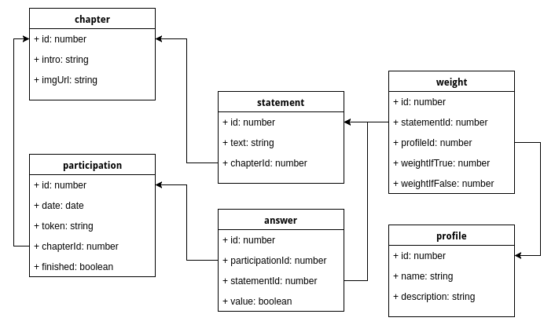

# PsychoQuiz Star Wars

## Architecture

### Frontend

- `/` Accueil avec bouton Quiz
- `/quiz` Quiz
    - `/quiz/0`  Introduction
    - `/quiz/1` Chapitre 1
        - Affirmation 1
        - Affirmation 2
        - ...
    - `/quiz/2/` Chapitre 2
        - Affirmation 1
        - Affirmation 2
        - ...
    - ...
    - `/quiz/results` Fin du quiz – Page de résultat
- `a-propos` A propos

#### Possibilité d'avoir un arbre d'affirmations

Ce qui permettrait de se passer des chapitres, car on a un autre type de structure.
Le système sous forme d'arbre permettrait de "forcer le trait" de chaque profil : sans l'arbre, comment faire pour assurer qu’un sondé n’obtienne pas un score de 20% pour chacun des 5 profils ? Ou de 50% sur deux profils, etc.

L'idée de l'arbre est que chaque affirmation stocke l'affirmation suivante en fonction du **oui** et en fonction du **non**. Il est possible de stocker la même affirmation dans **oui** et dans **non**, il s'agirait ainsi d'un choix n'indiquant pas d'affirmation spécifique.


### Backend

Le calcul "psycho" se fait côté serveur, en fonction des réponses données.

#### Technologies backend

NodeJS + mysql

#### Base de données
Base de données mysql (relationnel standard sans chichis)

##### Format d'un chapitre
```js
"chapter": {
	"id": number,
	"intro": string,
	"imgUrl": string,
}
```

##### Format d'une affirmation
```js
"statement": {
    "id": number,
    "text": string,
    "chapterId": number
}
```
##### Format d'un profil
p.ex Luke, Leia, etc.
```js
"profile": {
	"id": number,
	"name": string,
	"description": string
}
```
##### Format d'un poids
permettant de définir l'importance d'un profil en fonction d'une affirmation
```js
"weight": {
	"statementId": number,
	"profileId": number,
	"weightIfTrue": number,
	"weightIfFalse": number
}
```
##### Format d'une participation
avec un token généré qui sera dans la base de données

```js
"participation": {
    "id": number,
    "date": Date,
    "token": string,
    "chapterId": number, // défini le statut de la participation
    "finished": boolean // si "true", alors un calcul peut être fait avec toutes les réponses
}
```
##### Format d'une réponse
```js
"answer": {
    "id": number,
    "participationId": number,
    "statementId": number,
    "value": boolean
}
```

[](http://htmlpreview.github.io/?https://github.com/MediaComem/psychoquiz/blob/master/PsychoQuizBackend.html)


#### Calculs des résultats

Chaque réponse `answer` est pondérée selont la table `weight`. A la fin du quiz, un calcul est effectué pour calculer le profil `profile` le plus spécifique.

Chaque affirmation `statement`  peut avoir plusieurs définitions de poids `weight` pour chaque profil. Au préalable, les poids sont définis pour chaque profil pour chaque affirmation.

Par exemple, l'affirmation suivante : "Je pars en courant" peut avoir un poids de `-3` si on répond `true` ou  de `+3` si on répond `false` dans le profil **Luke Skywalker**, mais également un poids de `+2`  si on répond `true` et `-2` pour `false` dans le profil **Han Solo**, et ce pour chaque profil et chaque affirmation.

**Exemple d'affirmation**

| Affirmation           | Profil        | poids si juste | poids si faux  |
|-----------------------|---------------|----------------|----------------|
|Je pars en courant     | Han Solo      | -3             | +3             |
|                       | Luke Skywalker| +2             | -2             |
|                       | Leia          | 0              | 0              |


Les resultats sont un tableau de profils avec une valeur en pourcentage pour chacun des profils: 
```json
"results" : [{
    "profileId": 1,
    "points": 43        
}, {
    "profileId": 2,
    "points": -2
}, {}]
```

Tous les `points` sont additionné le resultat vaut 100%. Un pourcentage est ensuite calculé pour chaque profil et un diagramme est montré.


---


## Angular

This project was generated with [Angular CLI](https://github.com/angular/angular-cli) version 1.0.0-rc.1.

### Development server
Run `ng serve` for a dev server. Navigate to `http://localhost:4200/`. The app will automatically reload if you change any of the source files.

### Code scaffolding

Run `ng generate component component-name` to generate a new component. You can also use `ng generate directive/pipe/service/class/module`.

### Build

Run `ng build` to build the project. The build artifacts will be stored in the `dist/` directory. Use the `-prod` flag for a production build.

### Running unit tests

Run `ng test` to execute the unit tests via [Karma](https://karma-runner.github.io).

### Running end-to-end tests

Run `ng e2e` to execute the end-to-end tests via [Protractor](http://www.protractortest.org/).
Before running the tests make sure you are serving the app via `ng serve`.

### Further help

To get more help on the Angular CLI use `ng help` or go check out the [Angular CLI README](https://github.com/angular/angular-cli/blob/master/README.md).
